# מבוא

פרק המבוא נועד להסביר בצורה ברורה **מהו הפרויקט, למה הוא נבחר, למי הוא מיועד ומה המערכת אמורה לבצע**.

המטרה היא לא להציג עדיין את הקוד או את הארכיטקטורה המלאה, אלא לתת לקורא תמונה ברורה של הרעיון, הבעיה שהמערכת פותרת, היכולות המרכזיות שלה ותהליך התכנון הראשוני.

---

# 1. ייזום הפרויקט

## 1.1 תיאור ראשוני של המערכת

יש לכתוב תקציר קצר וברור של הפרויקט.

יש להסביר:

* מהי המערכת.
* מה היא אמורה לבצע.
* מה יהיה המוצר הסופי.
* מדוע נבחר הפרויקט.
* אילו אתגרים צפויים במהלך הפיתוח.

מומלץ לכתוב פסקה של 5–10 שורות.

דוגמה:

הפרויקט הוא מערכת Client-Server המיועדת לניטור פעילות ברשת מקומית. המערכת מאפשרת לזהות אירועים חשודים, להציג מידע למשתמש ולשמור היסטוריית אירועים. בחרתי בפרויקט משום שהוא משלב בין תכנות, תקשורת מחשבים ואבטחת מידע.

כדי להמחיש את הרעיון הכללי של המערכת ניתן להוסיף תרשים פשוט:

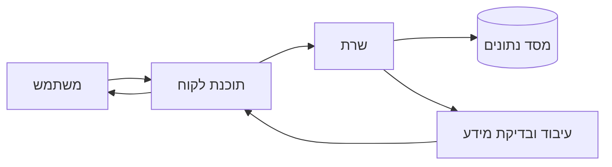

התרשים אינו מחליף את ההסבר המילולי אלא משלים אותו.

---

## 1.2 הגדרת הלקוח

יש להסביר **למי המערכת מיועדת ומי צפוי להשתמש בה**.

לדוגמה:

* משתמש ביתי.
* מנהל רשת.
* מנהל מערכת.
* עובד בארגון.
* תלמיד.
* משתמש רגיל ומנהל מערכת.

אם קיימים מספר סוגי משתמשים, ניתן להמחיש זאת בתרשים:

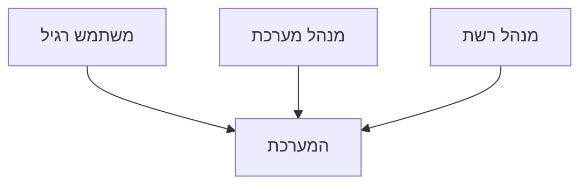

אין צורך עדיין לפרט את כל הפעולות של כל משתמש. פירוט היכולות יופיע בהמשך.

---

## 1.3 יעדים ומטרות

יש לפרט את המטרות המרכזיות של המערכת.

המטרות צריכות לתאר **מה המערכת אמורה להשיג**, ולא כיצד היא ממומשת.

לדוגמה:

* לאפשר למשתמש להתחבר למערכת.
* לאפשר העברת מידע בין Client ל־Server.
* לזהות פעילות חשודה ברשת.
* לשמור מידע במסד נתונים.
* להציג התראות למשתמש.

ניתן להציג את המטרות גם בצורה גרפית:

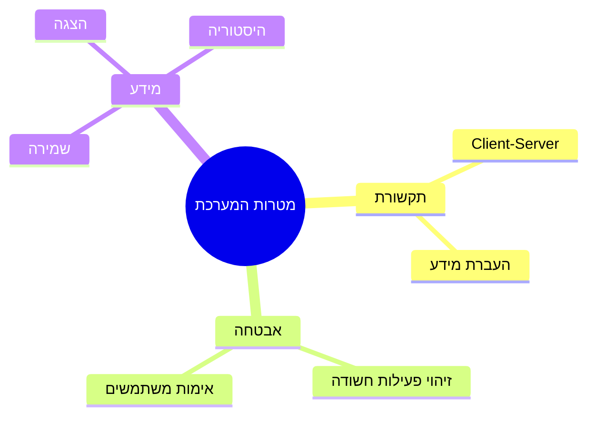

---

## 1.4 הבעיה, התועלת והחיסכון

יש להסביר מהי הבעיה שהמערכת מנסה לפתור.

מומלץ להציג את הקשר בין הבעיה לפתרון:

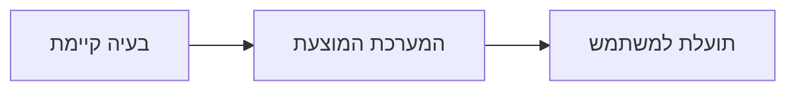

לדוגמה:

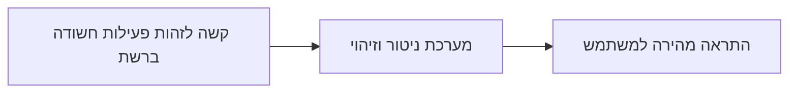

יש להסביר במלל:

### מהי הבעיה הקיימת?

מה קשה לבצע כיום ללא המערכת?

### מה המערכת מנסה להשיג?

מה ישתפר לאחר השימוש במערכת?

### מהי התועלת למשתמש?

לדוגמה:

* חיסכון בזמן.
* שיפור אבטחה.
* מניעת טעויות.
* אוטומציה.
* קבלת התראות בזמן אמת.

---

## 1.5 סקירת פתרונות קיימים

יש לבדוק האם קיימות מערכות או תוכנות שמבצעות פעולה דומה.

מומלץ להציג בטבלה:

| מערכת קיימת | יתרונות | חסרונות | ההבדל מהפרויקט |
| ----------- | ------- | ------- | -------------- |
| מערכת א'    | ...     | ...     | ...            |
| מערכת ב'    | ...     | ...     | ...            |

במקרה זה טבלה עדיפה על Mermaid, משום שהמטרה היא לבצע השוואה.

---

## 1.6 סקירת טכנולוגיות הפרויקט

יש לתאר באופן כללי את הטכנולוגיות העיקריות הקשורות לפרויקט.

לדוגמה:

* Python
* TCP/IP
* Sockets
* SQLite
* PyQt
* Scapy
* Encryption
* Hashing

אפשר להציג את הקשרים ביניהן:

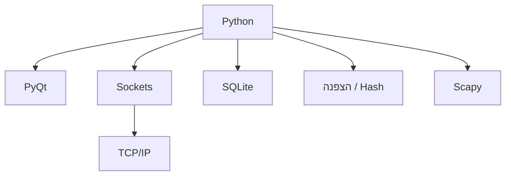

לכל טכנולוגיה יש להוסיף גם הסבר מילולי קצר.

---

## 1.7 מגבלות וסייגים

יש להסביר האם קיימות מגבלות שמשפיעות על המערכת.

לדוגמה:

* צורך בהרשאות Administrator.
* צורך בחיבור לרשת.
* צורך בציוד מיוחד.
* מגבלות של מערכת ההפעלה.
* תלות בספרייה מסוימת.

אפשר להציג קשר פשוט:

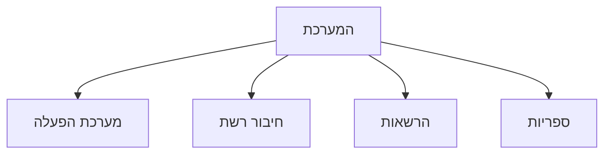

---

## 1.8 תיחום הפרויקט

יש להגדיר בצורה ברורה **במה הפרויקט עוסק ובמה הוא אינו עוסק**.

אפשר להציג זאת בתרשים:

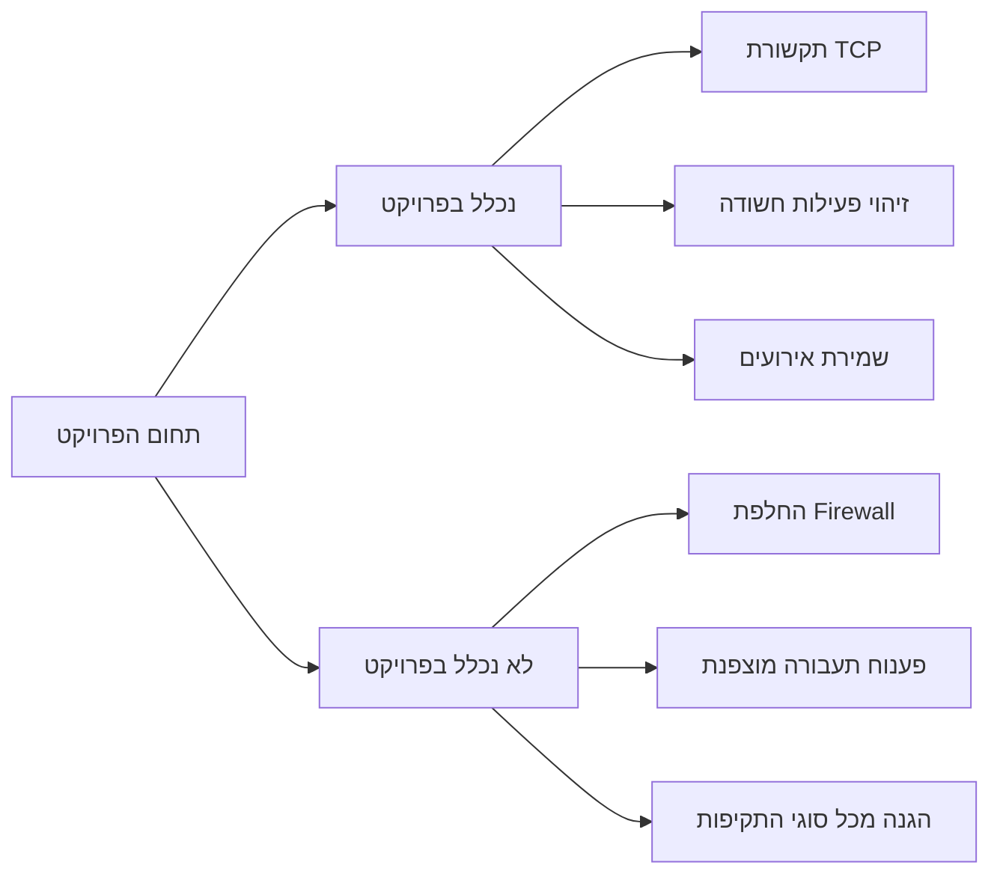

תרשים כזה עוזר מאוד לבוחן להבין מיד את גבולות הפרויקט.

---

# 2. אפיון המערכת

לאחר שהוצג הרעיון הכללי, יש לתאר בצורה מפורטת יותר **מה המערכת אמורה לעשות בפועל**.

---

## 2.1 תיאור מפורט של המערכת

כדאי לשלב כאן תרשים זרימה של הפעולה המרכזית.

לדוגמה:

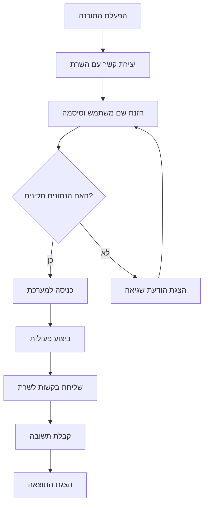

זהו אחד המקומות החשובים ביותר לשלב Mermaid.

---

## 2.2 יכולות לפי סוג משתמש

אם קיימים מספר משתמשים, ניתן להמחיש את החלוקה:

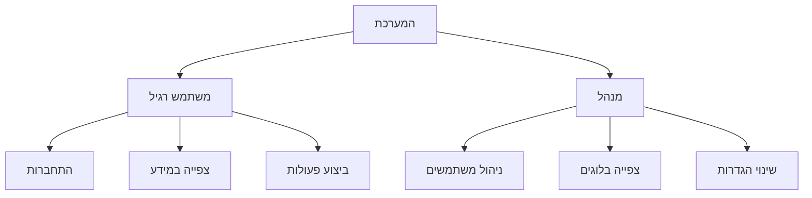

---

## 2.3 בדיקות מתוכננות – Black Box

לבדיקות עדיף להשתמש בעיקר בטבלה:

| מס' | מה נבדק       | קלט / פעולה            | תוצאה צפויה     |
| --- | ------------- | ---------------------- | --------------- |
| 1   | התחברות תקינה | שם משתמש וסיסמה תקינים | מעבר למסך הראשי |
| 2   | סיסמה שגויה   | סיסמה שגויה            | הודעת שגיאה     |
| 3   | משתמש לא קיים | שם משתמש לא קיים       | דחיית ההתחברות  |

אך ניתן להוסיף תרשים המסביר את עקרון Black Box:

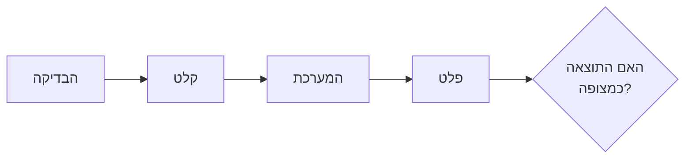

הבדיקה מתמקדת בקלט ובפלט ולא במימוש הפנימי.

---

## 2.4 תכנון וניהול לוח זמנים

יש לתכנן מראש את שלבי הפיתוח המרכזיים של הפרויקט ולציין לכל שלב את המועד המתוכנן ואת המועד שבו בוצע בפועל.

המטרה אינה רק להראות מתי הסתיים כל שלב, אלא גם לאפשר השוואה בין **התכנון המקורי** לבין **מה שקרה בפועל במהלך הפיתוח**.

חשוב לשמור את התכנון הראשוני ולא לשנות אותו בדיעבד כך שיתאים לביצוע בפועל.

### דוגמה – פרויקט Sniffer קטן

נניח שהתלמיד מפתח תוכנת Sniffer בסיסית ב־Python, שמאזינה לתעבורת הרשת, מציגה חבילות TCP/UDP/ICMP ומאפשרת סינון בסיסי.

| שלב                      | מה מבצעים בשלב                                         | מועד מתוכנן    | מועד בפועל            |
| ------------------------ | ------------------------------------------------------ | -------------- | --------------------- |
| בחירת נושא והגדרת דרישות | הגדרת מטרת ה־Sniffer והיכולות הרצויות                  | 1–7 בספטמבר    | 1–5 בספטמבר           |
| לימוד בסיסי של תקשורת    | רענון TCP/IP, פורטים, כתובות IP וסוגי חבילות           | 8–14 בספטמבר   | 6–15 בספטמבר          |
| לימוד ספריית Scapy       | קליטת חבילות והצגת מידע בסיסי                          | 15–21 בספטמבר  | 16–24 בספטמבר         |
| בניית Sniffer ראשוני     | קליטת חבילות מהרשת והדפסת Source/Destination           | 22–30 בספטמבר  | 25 בספטמבר–3 באוקטובר |
| זיהוי פרוטוקולים         | זיהוי והפרדה בין TCP, UDP ו־ICMP                       | 1–7 באוקטובר   | 4–10 באוקטובר         |
| הוספת ממשק משתמש         | הצגת החבילות בחלון GUI במקום Console                   | 8–20 באוקטובר  | 11–25 באוקטובר        |
| הוספת סינון              | סינון לפי פרוטוקול, IP או Port                         | 21–31 באוקטובר | 26 באוקטובר–4 בנובמבר |
| שמירת תוצאות             | שמירת מידע לקובץ CSV או PCAP                           | 1–7 בנובמבר    | 5–11 בנובמבר          |
| בדיקות ותיקון תקלות      | בדיקות Black Box, תיקון קריסות ושגיאות                 | 8–20 בנובמבר   | 12–24 בנובמבר         |
| שיפור ממשק               | שיפור תצוגה, הודעות שגיאה ונוחות שימוש                 | 21–30 בנובמבר  | 25 בנובמבר–2 בדצמבר   |
| תיעוד                    | הוספת הערות לקוד וכתיבת החלקים הרלוונטיים בתיק הפרויקט | 1–10 בדצמבר    | 3–12 בדצמבר           |

### כיצד לכתוב את הטבלה בפרויקט שלכם

אין צורך להשתמש בדיוק בשלבים שמופיעים בדוגמה.

יש להתאים את הטבלה לפרויקט בפועל ולפרק את העבודה ל־**אבני דרך משמעותיות**.

לדוגמה, בפרויקט Client-Server ניתן לכלול שלבים כמו:

* בניית השרת.
* בניית הלקוח.
* יצירת פרוטוקול תקשורת.
* מסד נתונים.
* התחברות משתמשים.
* הצפנה.
* בדיקות.

בפרויקט Sniffer ניתן לכלול:

* קליטת חבילות.
* ניתוח Protocol.
* סינון.
* GUI.
* שמירת נתונים.
* זיהוי פעילות חשודה.

### הסבר לאחר הטבלה

לאחר הטבלה מומלץ להוסיף פסקה קצרה המסבירה אם היו פערים משמעותיים בין התכנון לביצוע.

לדוגמה:

במהלך הפיתוח התברר שהעבודה עם Scapy והצגת החבילות בממשק הגרפי מורכבות יותר מהצפוי. כתוצאה מכך שלב בניית הממשק התארך במספר ימים, וגם שלב הסינון התחיל מאוחר יותר. לעומת זאת, שלב זיהוי הפרוטוקולים היה פשוט יותר מהצפוי והושלם בזמן קצר יחסית.

אין בעיה אם קיימים עיכובים בלוח הזמנים. להפך, הצגה של התכנון מול הביצוע בפועל מראה שהתלמיד עקב אחר תהליך העבודה ויודע להסביר את השינויים שהתרחשו במהלך הפיתוח.

---

## 2.5 ניהול סיכונים

גם כאן אפשר להוסיף תרשים קצר:

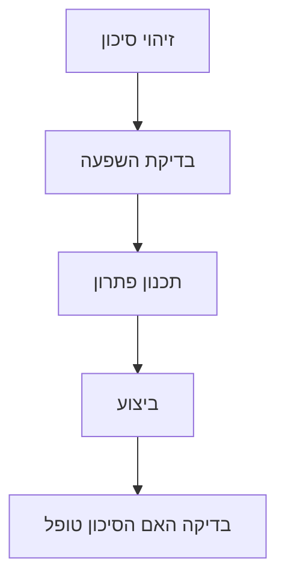

ולצדו הטבלה:

| סיכון             | השפעה אפשרית              | דרך התמודדות מתוכננת | מה בוצע בפועל |
| ----------------- | ------------------------- | -------------------- | ------------- |
| תקלה בתקשורת      | Client ו־Server לא יתקשרו | בניית אבטיפוס מוקדם  | ...           |
| אובדן קוד         | אובדן עבודה               | שימוש ב־GitHub       | ...           |
| קושי בספרייה חדשה | עיכוב בפיתוח              | לימוד ותיעוד         | ...           |

---

# 3. תיאור תחום הידע וניתוח היכולות

בחלק זה עוברים מהתיאור הכללי לניתוח מעמיק יותר של היכולות המרכזיות במערכת.

---

## 3.1 יכולות בצד השרת ובצד הלקוח

מומלץ מאוד להשתמש בתרשים הבא:

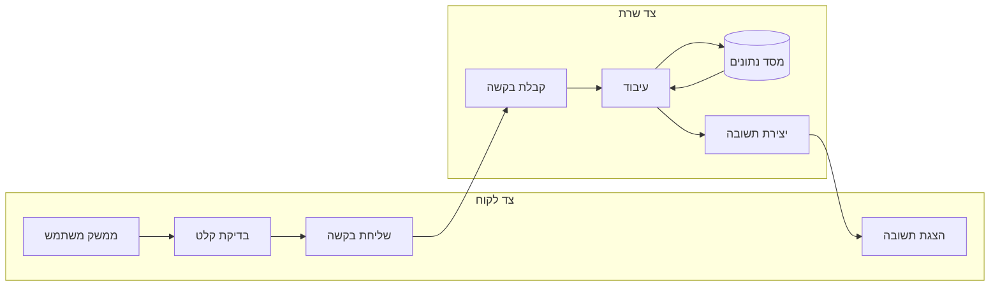

התרשים ממחיש היטב את ההפרדה בין צד הלקוח לצד השרת.

---

# 3.2 פירוט יכולת מרכזית

לכל יכולת משמעותית מומלץ לצרף תרשים זרימה קטן.

לדוגמה:

## יכולת: הרשמה למערכת

### מהות

יצירת משתמש חדש במערכת באמצעות קליטת פרטי המשתמש, בדיקתם ושמירתם במערכת.

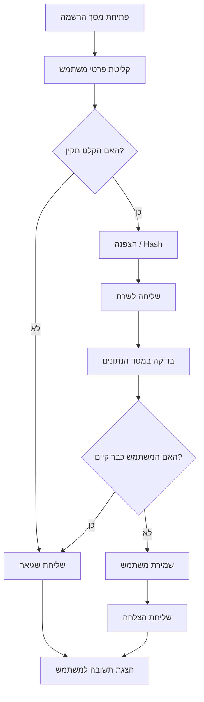

### פעולות נדרשות

1. הצגת מסך הרשמה.
2. קליטת פרטי המשתמש.
3. בדיקת תקינות.
4. הצפנה או Hash של מידע רגיש, אם נדרש.
5. שליחת הנתונים לשרת.
6. בדיקה מול בסיס הנתונים.
7. שמירת המשתמש.
8. החזרת תשובה ללקוח.
9. הצגת התוצאה.

### אובייקטים / רכיבים נחוצים

* ממשק משתמש.
* Client.
* Server.
* תקשורת.
* מסד נתונים.
* מנגנון הצפנה או Hash.

---

# המלצה לשימוש בתרשימים בפרק המבוא

אין צורך להוסיף תרשים לכל סעיף.

מומלץ שבפרק המבוא יהיו בערך **4–6 תרשימים משמעותיים**, למשל:

1. תרשים כללי של המערכת.
2. תרשים מטרות או משתמשים.
3. תרשים זרימת הפעולה המרכזית.
4. תרשים Gantt.
5. תרשים Client-Server.
6. תרשים עבור יכולת מרכזית אחת או שתיים.

המטרה היא שהתרשימים **יעזרו להבין את הפרויקט**, ולא רק ישמשו כקישוט.
