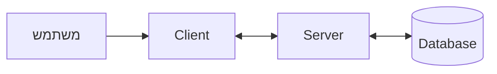
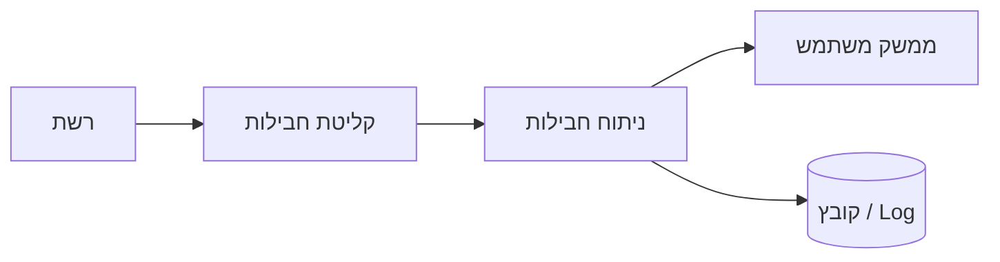
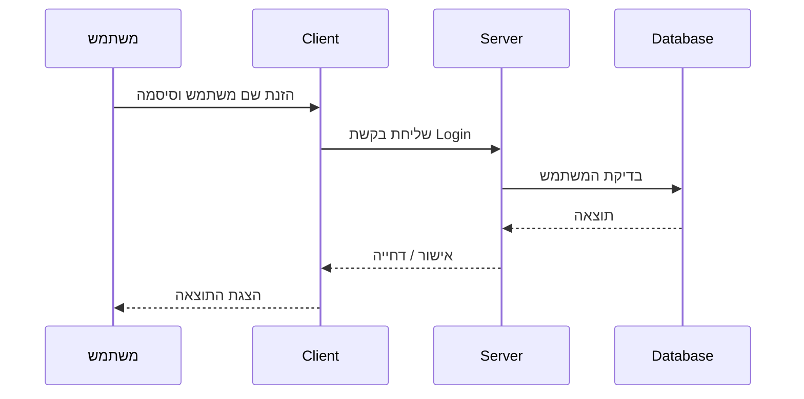
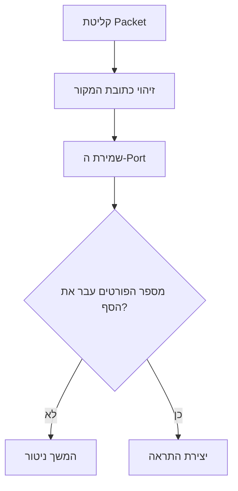
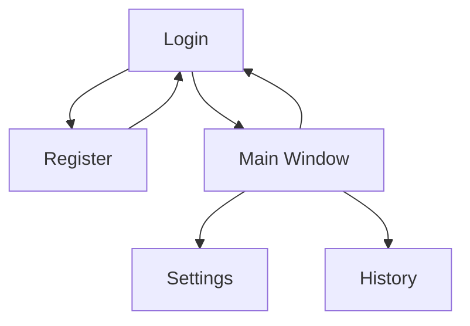
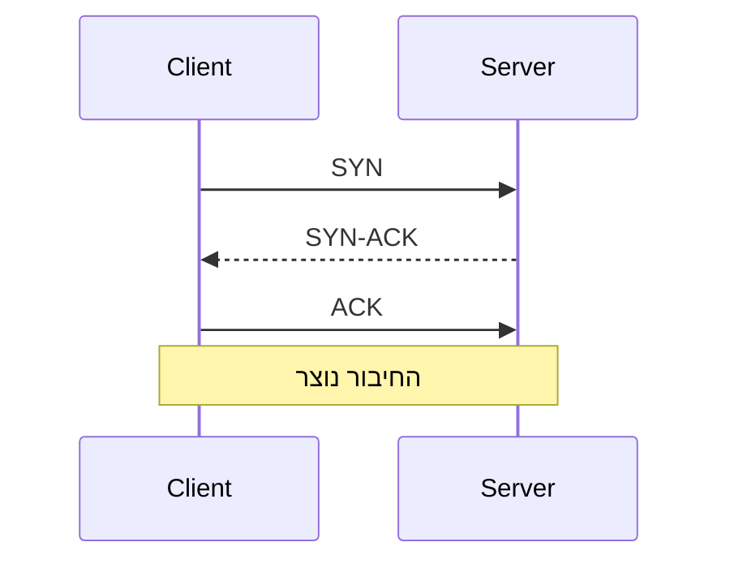

# מבנה / ארכיטקטורה

בפרק זה יוצג המבנה הכללי של המערכת והאופן שבו הרכיבים השונים שלה פועלים יחד.

מטרת הפרק היא להסביר כיצד הפרויקט בנוי מבחינה טכנולוגית ותפעולית, עוד לפני הצגת המימוש בקוד. במסגרת הפרק יש לתאר את הארכיטקטורה של המערכת, רכיבי החומרה והתוכנה, הטכנולוגיות שבהן נעשה שימוש, זרימת המידע בין הרכיבים, האלגוריתמים המרכזיים, סביבת הפיתוח, פרוטוקול התקשורת, מסכי המערכת, מבני הנתונים והאיומים הרלוונטיים.

יש להתייחס רק לרכיבים ולנושאים שבאמת קיימים בפרויקט. אין צורך להוסיף טכנולוגיות, איומים או מבנים שאינם חלק מהמערכת בפועל.

---

# 1. ארכיטקטורת המערכת

יש לתאר את המבנה הכללי של המערכת ואת הקשרים בין הרכיבים המרכזיים.

התרשים צריך להציג את הרכיבים ברמה גבוהה בלבד, ולא כל מחלקה, פונקציה או קובץ.

לדוגמה, בפרויקט Client-Server:



לאחר התרשים יש להסביר בקצרה את תפקידו של כל רכיב.

לדוגמה:

* **Client** – אחראי על ממשק המשתמש, קליטת פעולות המשתמש ושליחת בקשות לשרת.
* **Server** – מקבל בקשות מהלקוחות, מעבד אותן ומחזיר תשובות.
* **Database** – משמש לשמירת מידע קבוע של המערכת.
* **User** – משתמש במערכת דרך ממשק הלקוח.

אם הפרויקט אינו בנוי במבנה Client-Server, יש להתאים את התרשים למבנה האמיתי של המערכת.

לדוגמה, בפרויקט Sniffer:



לפי ההנחיות, יש לצרף שרטוט שמציג את רכיבי המערכת והקשרים ביניהם.

---

# 2. תיאור החומרה

יש לפרט את רכיבי החומרה הדרושים להפעלת המערכת.

לדוגמה:

* מחשב לקוח.
* מחשב שרת.
* נתב או Switch.
* כרטיס רשת.
* מצלמה.
* ESP32.
* חיישנים.
* התקנים נוספים שנדרשים לפרויקט.

אם הפרויקט פועל על מחשב יחיד בלבד, יש לציין זאת במפורש.

לדוגמה:

> המערכת פועלת על מחשב Windows יחיד המחובר לרשת המקומית. קליטת התעבורה מתבצעת באמצעות כרטיס הרשת של המחשב.

אם קיימים מספר רכיבי חומרה שיש ביניהם קשר ישיר, מומלץ לצרף תרשים נוסף. אם המבנה פשוט, אין צורך בתרשים נפרד.

---

# 3. טכנולוגיות הפרויקט

יש לפרט את הטכנולוגיות המרכזיות שבהן נעשה שימוש בפועל.

מומלץ להציג אותן בטבלה:

| טכנולוגיה      | תפקיד בפרויקט              |
| -------------- | -------------------------- |
| Python         | שפת התכנות הראשית          |
| PyQt / Tkinter | בניית ממשק המשתמש          |
| Socket         | תקשורת בין Client ל־Server |
| SQLite         | שמירת מידע                 |
| Scapy          | קליטה וניתוח חבילות רשת    |
| TCP/IP         | תקשורת ברשת                |
| GitHub         | ניהול גרסאות וגיבוי        |

לאחר הטבלה ניתן להוסיף משפט קצר שמסביר מדוע נבחרו הטכנולוגיות המרכזיות.

לדוגמה:

> Python נבחרה משום שהיא מאפשרת פיתוח מהיר ומשלבת היטב ספריות לתקשורת, ממשק משתמש וניתוח רשת.

יש להתייחס רק לטכנולוגיות שנעשה בהן שימוש בפועל.

---

# 4. זרימת המידע במערכת

יש להסביר כיצד המידע עובר בין רכיבי המערכת במהלך ביצוע פעולה מרכזית.

מומלץ לבחור 1–3 תהליכים מרכזיים בלבד.

לדוגמה, תהליך התחברות משתמש:



לאחר התרשים יש להסביר את התהליך במילים.

לדוגמה:

1. המשתמש מזין את פרטי ההתחברות.
2. ה־Client שולח את הבקשה לשרת.
3. השרת בודק את הנתונים מול מסד הנתונים.
4. השרת מחזיר תשובה.
5. ה־Client מציג למשתמש אם ההתחברות הצליחה או נכשלה.

יש להכין תרשימים רק עבור תהליכים משמעותיים, כגון:

* Login.
* שליחת קובץ.
* קבלת מידע.
* זיהוי פעילות חשודה.
* שמירת מידע.

לפי ההנחיות, יש להציג את זרימת המידע בין הרכיבים המרכזיים באמצעות שרטוט.

---

# 5. אלגוריתמים מרכזיים בפרויקט

יש לתאר את הבעיות האלגוריתמיות המשמעותיות בפרויקט.

לכל אלגוריתם מרכזי יש להסביר:

1. מהי הבעיה שהוא פותר.
2. אילו פתרונות אפשריים קיימים.
3. מהו הפתרון שנבחר.
4. מדוע נבחר פתרון זה.
5. מהם היתרונות והחסרונות שלו.

אין צורך לתאר כל פונקציה בקוד.

לדוגמה, בפרויקט Sniffer ניתן להסביר אלגוריתם לזיהוי Port Scan.

המערכת עוקבת אחר ניסיונות התחברות ממקור מסוים למספר פורטים שונים בפרק זמן קצר. אם מספר הפורטים עובר סף שהוגדר מראש, הפעילות מסומנת כחשודה.



תרשים מתאים במיוחד כאשר האלגוריתם כולל מספר שלבים או תנאי החלטה.

לפי ההנחיות, יש להציג גם פתרונות אפשריים, להפנות למקורות רלוונטיים ולנמק את בחירת הפתרון.

---

# 6. סביבת הפיתוח והבדיקות

יש לתאר את סביבת העבודה שבה פותח הפרויקט.

מומלץ להשתמש בטבלה:

| רכיב               | שימוש             |
| ------------------ | ----------------- |
| Windows 11         | מערכת הפעלה       |
| Python 3.x         | סביבת הרצה        |
| Visual Studio Code | כתיבת הקוד        |
| Git                | ניהול גרסאות      |
| GitHub             | שמירת וגיבוי הקוד |
| Wireshark          | בדיקת תעבורת רשת  |

יש לציין גם את הכלים ששימשו לבדיקה.

לדוגמה:

* Wireshark לבדיקת תעבורה.
* Postman לבדיקת API.
* SQLite Browser לבדיקת מסד נתונים.
* Terminal לבדיקת תקשורת.
* כלי Debug של סביבת הפיתוח.

לפי המסמך הרשמי, יש לפרט הן את כלי הפיתוח והן את הכלים הנדרשים לבדיקות.

---

# 7. פרוטוקול התקשורת

אם המערכת כוללת תקשורת בין רכיבים, יש לתאר את פרוטוקול התקשורת.

יש להסביר:

* האם נעשה שימוש ב־TCP או UDP.
* באיזה Port משתמשים.
* כיצד נראית הודעה.
* כיצד השרת מזהה את סוג הפעולה.
* כיצד נקבע אורך ההודעה.
* כיצד נשלחים נתונים.
* האם המידע מוצפן.

לדוגמה:

```json
{
  "action": "LOGIN",
  "username": "ran",
  "password": "1234"
}
```

יש להציג את סוגי ההודעות בטבלה:

| שם ההודעה   | כיוון           | שדות               | תפקיד             |
| ----------- | --------------- | ------------------ | ----------------- |
| LOGIN       | Client → Server | username, password | בקשת התחברות      |
| LOGIN_OK    | Server → Client | status             | אישור התחברות     |
| LOGIN_ERROR | Server → Client | error              | החזרת הודעת שגיאה |
| GET_DATA    | Client → Server | request_id         | בקשת מידע         |

אם נעשה שימוש ב־Header קבוע, JSON, Binary Protocol, הצפנה או מנגנון קביעת אורך הודעה, יש להסביר אותם.

לפי ההנחיות, יש לפרט את מבנה ההודעות, מי שולח כל הודעה ולאן, ומהם השדות הכלולים בה.

---

# 8. מסכי המערכת

יש לתאר את המסכים המרכזיים במערכת.

לכל מסך יש לציין:

* שם המסך.
* תפקיד המסך.
* המידע שמוצג בו.
* הפעולות שניתן לבצע.
* צילום מסך.

לדוגמה:

## מסך Login

מסך זה מאפשר למשתמש להזין שם משתמש וסיסמה ולהתחבר למערכת.

המסך כולל:

* שדה Username.
* שדה Password.
* כפתור Login.
* כפתור Register.
* אזור להצגת הודעות שגיאה.

יש לצרף צילום מסך של המסך בפועל.

אין צורך להקדיש עמוד שלם לכל מסך פשוט, אך יש לוודא שכל המסכים המרכזיים מתועדים.

---

# 9. תרשים מעבר בין מסכים

אם במערכת קיימים מספר מסכים, יש להציג את הקשרים והמעברים ביניהם.

לדוגמה:



מטרת התרשים היא להראות בצורה ברורה כיצד המשתמש מתקדם בין מסכי המערכת.

לפי ההנחיות, יש לצרף תרשים המתאר את היררכיית המסכים והמעברים ביניהם.

---

# 10. מבני הנתונים ומאגרי המידע

יש להסביר כיצד המערכת שומרת מידע.

לדוגמה:

* מסד נתונים.
* JSON.
* CSV.
* קבצי Log.
* קבצים בינאריים.
* מבני נתונים מרכזיים בזיכרון.

אם נעשה שימוש במסד נתונים, יש לפרט את הטבלאות.

לדוגמה:

## טבלת Users

| שדה           | טיפוס   | תיאור          | דוגמה |
| ------------- | ------- | -------------- | ----- |
| id            | INTEGER | מזהה משתמש     | 15    |
| username      | TEXT    | שם משתמש       | ran   |
| password_hash | TEXT    | Hash של הסיסמה | ...   |
| role          | TEXT    | סוג המשתמש     | admin |

**Primary Key:** `id`

יש לבצע פירוט דומה לכל טבלה משמעותית.

לפי ההנחיות, יש לציין את שם בסיס הנתונים, שמות הטבלאות, השדות, הטיפוסים ודוגמאות לערכים, וכן את המפתח הראשי בכל טבלה.

---

# 11. סקירת חולשות ואיומים

חלק זה חשוב במיוחד בפרויקט בחלופת הגנת סייבר ומערכות הפעלה.

המטרה היא לבדוק אילו איומי אבטחה רלוונטיים למערכת וכיצד ניתן להתמודד איתם.

אין צורך להציג רשימה כללית של כל סוגי התקפות הסייבר.

יש להתייחס רק לאיומים שבאמת רלוונטיים לפרויקט.

לכל איום יש להסביר:

1. מהו האיום.
2. האם הוא רלוונטי למערכת.
3. מה עלול לקרות אם ההתקפה תצליח.
4. כיצד המערכת מתמודדת איתו.

מומלץ להשתמש בטבלה:

| איום          | האם רלוונטי? | הסיכון למערכת           | אמצעי ההגנה            |
| ------------- | ------------ | ----------------------- | ---------------------- |
| SQL Injection | כן           | גישה או שינוי מידע במסד | Parameterized Queries  |
| MITM          | כן           | יירוט מידע ברשת         | הצפנת התקשורת          |
| Brute Force   | כן           | ניחוש סיסמאות           | הגבלת ניסיונות         |
| DoS           | חלקית        | עומס על השרת            | הגבלת בקשות            |
| File Upload   | אם קיים      | העלאת קובץ לא תקין      | בדיקת סוג, גודל ו־Hash |

---

## 11.1 שכבת האפליקציה

יש לבדוק איומים שקשורים ללוגיקה של התוכנה ולממשק המשתמש.

לדוגמה:

### SQL Injection

אם המערכת משתמשת במסד נתונים, יש לבדוק האם משתמש יכול להכניס פקודות SQL דרך שדות קלט.

אם נעשה שימוש ב־Parameterized Queries, יש להסביר זאת.

### Login ואימות משתמשים

יש להסביר:

* כיצד מתבצע אימות המשתמש.
* כיצד נשמרות סיסמאות.
* האם קיימת הגבלת ניסיונות התחברות.
* האם קיימות הרשאות שונות למשתמשים שונים.

### העלאת קבצים

אם המערכת מאפשרת העלאת קבצים, יש לבדוק:

* סוג הקובץ.
* גודל הקובץ.
* שם הקובץ.
* נתיב השמירה.
* שימוש ב־Hash, אם רלוונטי.

---

## 11.2 שכבת התעבורה

אם המערכת מעבירה מידע ברשת, יש להתייחס גם לאיומים הקשורים לתקשורת.

### MITM – Man in the Middle

יש לבדוק האם תוקף יכול ליירט את המידע שעובר בין הלקוח לשרת.

אם נעשה שימוש בהצפנה, יש להסביר איזה סוג הצפנה משמש את המערכת.

### DoS / DDoS

יש לבדוק האם ניתן להציף את השרת במספר גדול של בקשות ולגרום לעומס או להשבתה.

אם קיים מנגנון הגנה, יש לתאר אותו.

### TCP

אם המערכת משתמשת ב־TCP, יש להסביר בקצרה את אופן יצירת החיבור, כולל Three-Way Handshake, כאשר הדבר רלוונטי להבנת הפרויקט.



אין צורך להעמיק מעבר לנדרש להבנת המערכת.

המסמך הרשמי דורש התייחסות לאיומים בשכבת האפליקציה ובשכבת התעבורה, כולל SQL Injection, Login, MITM, DoS/DDoS, העלאת קבצים ו־TCP.

---

# סיכום הפרק

בסיום פרק הארכיטקטורה הקורא אמור להבין:

* מהם הרכיבים המרכזיים במערכת.
* כיצד הם קשורים זה לזה.
* כיצד מידע עובר ביניהם.
* באילו טכנולוגיות נעשה שימוש.
* כיצד פועל פרוטוקול התקשורת.
* כיצד בנויים המסכים ומאגרי המידע.
* מהם האלגוריתמים המרכזיים.
* אילו איומי אבטחה רלוונטיים למערכת.
* כיצד המערכת מתמודדת עם איומים אלו.

אין צורך להעמיס בתרשימים. ברוב הפרויקטים מספיקים **3–5 תרשימים משמעותיים**:

1. תרשים ארכיטקטורה כללי.
2. תרשים Sequence לתהליך מרכזי.
3. תרשים Flowchart לאלגוריתם מרכזי.
4. תרשים מעבר בין מסכים.
5. תרשים TCP Handshake רק אם TCP רלוונטי לפרויקט.

טבלאות מתאימות יותר להצגת טכנולוגיות, הודעות בפרוטוקול, מבני מסד הנתונים וסקירת חולשות ואיומים.
