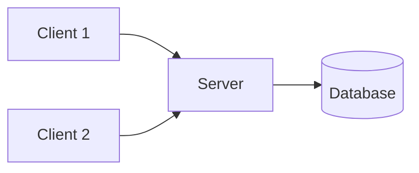
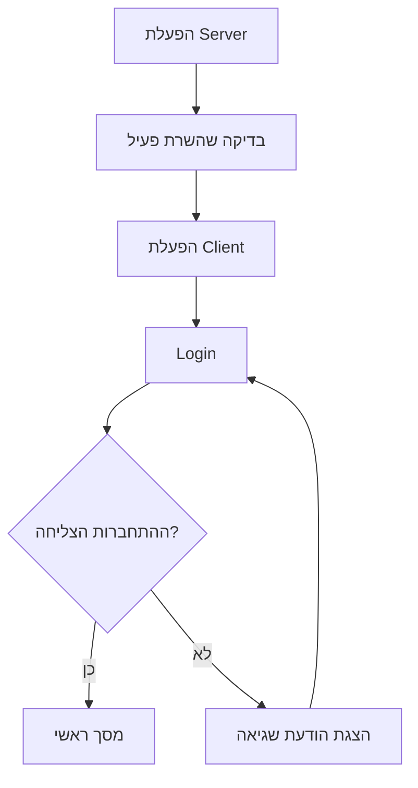
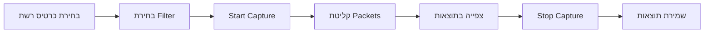

# מדריך למשתמש

פרק זה נועד לאפשר לאדם שלא פיתח את הפרויקט **להתקין, להפעיל ולהשתמש במערכת בצורה עצמאית**.

המדריך צריך להיות ברור, פשוט ומעשי. יש להימנע ככל האפשר מהסברים פנימיים על הקוד ולהתמקד במה שהמשתמש צריך לבצע בפועל.

המדריך צריך לענות על השאלות:

* אילו קבצים קיימים בפרויקט?
* מה צריך להתקין לפני הפעלת המערכת?
* כיצד מפעילים את המערכת?
* אילו הגדרות יש לבצע?
* כיצד משתמשים במסכים ובפעולות המרכזיות?
* מה עושים במקרה של שגיאה נפוצה?

---

# 1. מבנה קבצי המערכת

יש להציג את הקבצים והתיקיות המרכזיים בפרויקט באמצעות **עץ קבצים**.

אין צורך להציג קבצים אוטומטיים, קבצי Cache או קבצים שאינם חשובים להפעלת המערכת.

לדוגמה:

```text
project/
│
├── client/
│   ├── client.py
│   ├── main_window.py
│   └── login_window.py
│
├── server/
│   ├── server.py
│   └── database_manager.py
│
├── database/
│   └── users.db
│
├── assets/
│   ├── icons/
│   └── images/
│
├── logs/
│   └── system.log
│
├── requirements.txt
└── README.md
```

לאחר עץ הקבצים מומלץ להסביר בקצרה את הקבצים והתיקיות המרכזיים.

לדוגמה:

| קובץ / תיקייה         | תפקיד                       |
| --------------------- | --------------------------- |
| `client.py`           | הפעלת תוכנת הלקוח           |
| `server.py`           | הפעלת השרת                  |
| `database_manager.py` | עבודה עם בסיס הנתונים       |
| `users.db`            | בסיס הנתונים של המערכת      |
| `assets`              | תמונות ואייקונים            |
| `logs`                | קבצי תיעוד של פעולות המערכת |
| `requirements.txt`    | רשימת הספריות הנדרשות       |

---

# 2. דרישות מערכת

לפני התקנת הפרויקט יש לפרט את הסביבה הדרושה להפעלתו.

לדוגמה:

| רכיב                 | דרישה                       |
| -------------------- | --------------------------- |
| מערכת הפעלה          | Windows 10 / 11             |
| Python               | גרסה 3.x                    |
| זיכרון RAM           | לפחות 4GB                   |
| חיבור רשת            | נדרש                        |
| הרשאות Administrator | נדרש רק אם הפרויקט דורש זאת |

יש להתאים את הדרישות לפרויקט בפועל.

אין צורך לציין דרישות שאין להן משמעות לפרויקט.

---

# 3. התקנת הכלים הנדרשים

יש להסביר אילו תוכנות או כלים יש להתקין לפני הפעלת המערכת.

לדוגמה:

1. התקנת Python.
2. הורדת תיקיית הפרויקט.
3. פתיחת Terminal בתיקיית הפרויקט.
4. התקנת הספריות הנדרשות.

אם קיים קובץ `requirements.txt`, ניתן להתקין את כל הספריות באמצעות:

```bash
pip install -r requirements.txt
```

אם אין קובץ כזה, יש להציג את פקודות ההתקנה הדרושות.

לדוגמה:

```bash
pip install PyQt6
pip install scapy
```

אין להוסיף פקודות התקנה של ספריות שאינן בשימוש בפרויקט.

---

# 4. מיקום הקבצים

יש להסביר היכן צריכים להימצא הקבצים כדי שהמערכת תפעל בצורה תקינה.

לדוגמה:

> כל קבצי הפרויקט צריכים להישאר בתוך תיקיית הפרויקט המקורית. אין להעביר את בסיס הנתונים או את תיקיית התמונות למיקום אחר, מכיוון שהתוכנית משתמשת בנתיבים יחסיים.

אם קיימים קבצים שחייבים להיות במיקום מסוים, יש לציין זאת במפורש.

לדוגמה:

```text
project/
├── server.py
├── config.json
└── database/
    └── system.db
```

---

# 5. נתונים התחלתיים

אם המערכת דורשת נתונים ראשוניים לצורך הפעלה, יש לפרט אותם.

לדוגמה:

* משתמש מנהל ראשוני.
* כתובת שרת.
* Port.
* שם בסיס הנתונים.
* קובץ הגדרות.
* תיקייה שבה נשמרים קבצים.

לדוגמה:

```text
Server IP: 192.168.1.10
Port: 5050
```

אם קיימים משתמשים לדוגמה, ניתן להציג אותם רק אם הם מיועדים לצורכי בדיקה.

לדוגמה:

```text
Username: admin
Password: demo123
```

אין להציג בתיק הפרויקט סיסמאות אמיתיות, מפתחות הצפנה, Tokens או מידע רגיש אחר.

---

# 6. הגדרות רשת

אם הפרויקט כולל תקשורת בין מחשבים, יש להסביר כיצד יש להגדיר את הרשת.

יש לציין לפי הצורך:

* כתובת IP של השרת.
* Port.
* האם הלקוח והשרת חייבים להיות באותה רשת.
* האם נדרשת פתיחת Port ב־Firewall.
* האם נדרשת גישה לאינטרנט.

לדוגמה:

> השרת והלקוח צריכים להיות מחוברים לאותה רשת מקומית. כתובת ה־IP של השרת מוגדרת בקובץ ההגדרות של הלקוח.

אפשר להמחיש את מבנה ההפעלה בתרשים פשוט:



אין צורך להציג כאן שוב את כל תרשים הארכיטקטורה מפרק הארכיטקטורה. מטרת התרשים היא רק לעזור למשתמש להבין **איזה רכיב צריך לפעול ואיפה**.

---

# 7. ארכיטקטורה מינימלית נדרשת

יש להסביר מהו המבנה המינימלי הדרוש כדי להפעיל את המערכת.

לדוגמה, בפרויקט Client-Server:

* מחשב אחד שעליו מופעל השרת.
* מחשב אחד לפחות שעליו מופעל הלקוח.
* חיבור רשת בין המחשבים.
* בסיס נתונים הנגיש לשרת.

בפרויקט שפועל על מחשב יחיד:

> המערכת אינה דורשת מחשב שרת נפרד וניתן להפעיל את כל רכיבי הפרויקט על מחשב אחד.

---

# 8. הפעלת המערכת

יש להסביר את סדר ההפעלה בצורה ברורה.

לדוגמה:

1. יש לוודא שכל הספריות הותקנו.
2. יש לוודא שהמחשב מחובר לרשת.
3. יש להפעיל תחילה את השרת.
4. לאחר שהשרת פעיל, יש להפעיל את הלקוח.
5. יש להזין את פרטי ההתחברות.
6. לאחר התחברות מוצלחת יוצג המסך הראשי.

אפשר להמחיש את סדר ההפעלה באמצעות תרשים קטן:



תרשים זה מתאים במיוחד למערכת שבה חשוב לשמור על סדר הפעלה מסוים.

---

# 9. שימוש במערכת לפי סוג משתמש

אם קיימים מספר סוגי משתמשים, יש להכין הסבר לכל אחד מהם.

לדוגמה:

## 9.1 משתמש רגיל

יש להסביר:

* כיצד מתחברים.
* מה מופיע במסך הראשי.
* אילו פעולות ניתן לבצע.
* כיצד יוצאים מהמערכת.

לדוגמה:

1. פתח את תוכנת הלקוח.
2. הזן שם משתמש וסיסמה.
3. לחץ על `Login`.
4. לאחר התחברות מוצלחת יוצג המסך הראשי.
5. בחר את הפעולה הרצויה מהתפריט.

---

## 9.2 מנהל מערכת

אם קיים משתמש מסוג Administrator, יש להסביר בנפרד את הפעולות הייחודיות שלו.

לדוגמה:

מנהל המערכת יכול:

* לצפות ברשימת המשתמשים.
* לחסום משתמש.
* לצפות בלוגים.
* לשנות הגדרות.
* למחוק מידע, אם המערכת מאפשרת זאת.

יש לציין פעולות מנהל רק אם הן קיימות בפרויקט בפועל.

---

# 10. תיעוד מסכי המערכת

יש לצרף צילומי מסך של המסכים המרכזיים.

לכל צילום מסך יש להוסיף הסבר פשוט.

לדוגמה:

## מסך Login

**[כאן יש לצרף צילום מסך]**

מסך זה משמש להתחברות למערכת.

המשתמש נדרש:

1. להזין שם משתמש.
2. להזין סיסמה.
3. ללחוץ על `Login`.

אם אחד הפרטים אינו תקין, תוצג הודעת שגיאה.

---

## מסך ראשי

**[כאן יש לצרף צילום מסך]**

המסך הראשי מוצג לאחר התחברות מוצלחת.

במסך זה ניתן לבצע את הפעולות המרכזיות של המערכת.

מומלץ להסביר את האזורים או הכפתורים החשובים, למשל:

1. אזור הצגת מידע.
2. כפתור התחלת פעולה.
3. כפתור עצירה.
4. תפריט הגדרות.
5. יציאה מהמערכת.

אין צורך להסביר כפתורים שהמשמעות שלהם ברורה מאליה, אלא להתמקד בפעולות החשובות.

---

# 11. תהליך שימוש מרכזי

מומלץ לבחור פעולה מרכזית אחת במערכת ולהסביר אותה מתחילתה ועד סופה.

לדוגמה, בפרויקט Sniffer:

## התחלת ניטור תעבורה

1. הפעל את התוכנה.
2. בחר את כרטיס הרשת.
3. בחר מסנן, אם נדרש.
4. לחץ על `Start Capture`.
5. החבילות שנקלטות יוצגו בטבלה.
6. ניתן לבחור חבילה ולצפות בפרטים שלה.
7. לסיום לחץ על `Stop Capture`.
8. במידת הצורך שמור את התוצאות לקובץ.

אפשר להמחיש את התהליך:



אין צורך ליצור תרשים לכל פעולה במערכת.

תרשים אחד לתהליך המרכזי בדרך כלל מספיק.

---

# 12. הודעות שגיאה ותקלות נפוצות

מומלץ להוסיף טבלה קצרה של בעיות שהמשתמש עשוי להיתקל בהן.

| בעיה               | סיבה אפשרית          | פתרון                                 |
| ------------------ | -------------------- | ------------------------------------- |
| הלקוח אינו מתחבר   | השרת אינו פעיל       | הפעל את השרת                          |
| Connection Refused | IP או Port לא נכונים | בדוק את הגדרות החיבור                 |
| ספרייה חסרה        | הספרייה לא הותקנה    | הרץ `pip install -r requirements.txt` |
| אין תעבורת רשת     | נבחר כרטיס רשת שגוי  | בחר את כרטיס הרשת הפעיל               |
| Permission Error   | חסרות הרשאות         | הפעל בהרשאות המתאימות                 |

יש להציג רק בעיות שנמצאו או שעלולות להופיע במערכת בפועל.

---

# סיכום מדריך המשתמש

בסיום הפרק, אדם שלא מכיר את הפרויקט צריך להיות מסוגל:

* להבין אילו קבצים מרכיבים את המערכת.
* לדעת אילו תוכנות וספריות נדרשות.
* להתקין את המערכת.
* להגדיר את הרשת, אם נדרש.
* להפעיל את רכיבי המערכת בסדר הנכון.
* להתחבר למערכת.
* לבצע את הפעולות המרכזיות.
* להבין את המסכים המרכזיים.
* להתמודד עם תקלות בסיסיות.

מומלץ לשמור בפרק זה על שילוב מאוזן בין **הוראות קצרות, צילומי מסך, טבלאות ותרשימים**.

בדרך כלל מספיקים **1–3 תרשימי Mermaid**:

1. תרשים קצר של מבנה ההפעלה או הרשת.
2. תרשים של סדר הפעלת המערכת.
3. תרשים של הפעולה המרכזית שהמשתמש מבצע.

אין צורך להציג כאן שוב תרשימים טכניים מפורטים שכבר הוצגו בפרק הארכיטקטורה.
