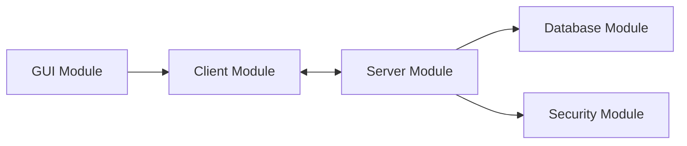
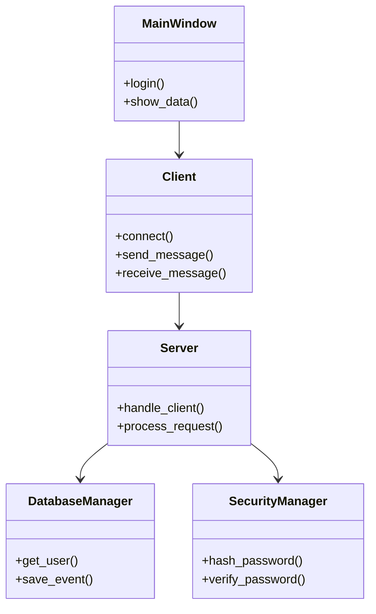
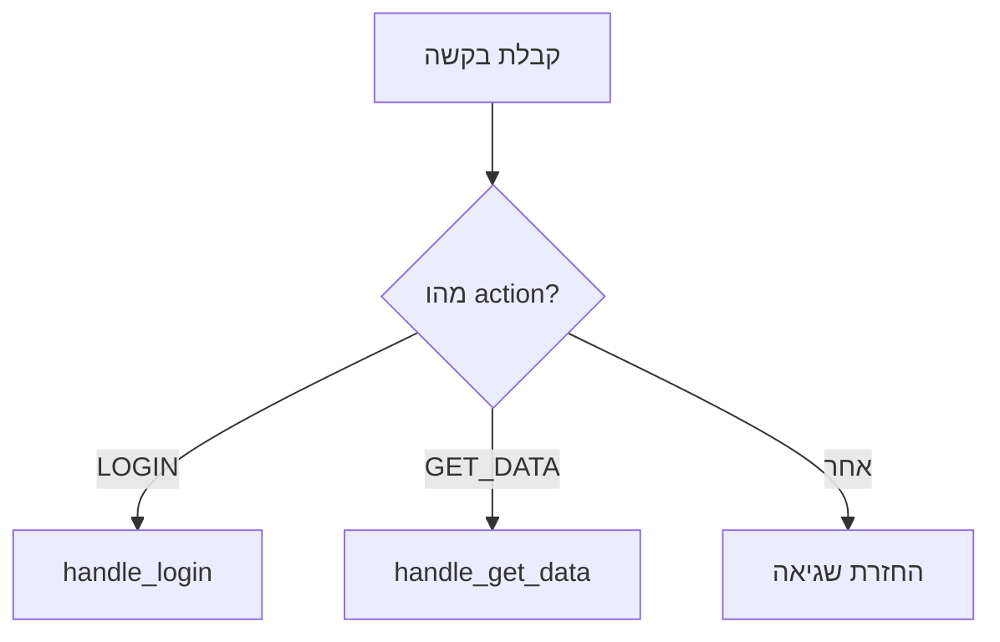

# מימוש הפרויקט

בפרק זה יש לתאר כיצד התכנון והארכיטקטורה שהוצגו בפרקים הקודמים מומשו בפועל בקוד.

המטרה אינה להדביק את כל קוד הפרויקט, אלא להסביר בצורה מסודרת כיצד המערכת בנויה ברמת המודולים, המחלקות והפעולות המרכזיות, ולהציג קטעי קוד משמעותיים שממחישים את אופן המימוש.

בנוסף, בפרק זה יש להציג את הבדיקות שבוצעו למערכת, את התוצאות שהתקבלו ואת אופן הטיפול בתקלות שהתגלו במהלך העבודה.

---

# חלק א' – מודולים ומחלקות

## 1. מבנה כללי של הקוד

יש להציג בקצרה כיצד קוד הפרויקט מחולק.

לדוגמה:

* מודולים של ממשק משתמש.
* מודולים של תקשורת.
* מודולים של מסד נתונים.
* מודולים של אבטחה.
* מודולים של לוגיקה עסקית.
* מודולים של ניתוח מידע.

אם הפרויקט כולל מספר רכיבים, ניתן להציג תרשים כללי אחד שמראה את הקשרים ביניהם.

לדוגמה:



התרשים צריך להציג את חלוקת הקוד ברמה גבוהה בלבד.

אין צורך להציג כל קובץ, מחלקה ופונקציה בתרשים.

---

# 2. מודולים וספריות מיובאים

יש להציג את המודולים והספריות שלא פותחו על ידי התלמיד אלא יובאו לצורך הפרויקט.

לכל מודול מספיק להסביר במשפט אחד מה תפקידו.

מומלץ להשתמש בטבלה:

| מודול / ספרייה | תפקיד בפרויקט           |
| -------------- | ----------------------- |
| socket         | יצירת תקשורת בין מחשבים |
| sqlite3        | עבודה עם בסיס נתונים    |
| hashlib        | חישוב Hash              |
| PyQt6          | בניית ממשק המשתמש       |
| scapy          | קליטה וניתוח חבילות רשת |
| threading      | הרצת פעולות במקביל      |

יש לכלול רק מודולים שבאמת נמצאים בשימוש בפרויקט.

אין צורך לפרט כל פונקציה של הספרייה.

---

# 3. מחלקות שפותחו בפרויקט

יש לתאר את המחלקות המרכזיות שהתלמיד פיתח בעצמו.

עבור כל מחלקה יש להציג:

* שם המחלקה באנגלית.
* תפקיד המחלקה.
* התכונות המרכזיות.
* הפעולות המרכזיות.

לפי ההנחיות הרשמיות, יש לציין עבור כל פעולה גם את הקלט שהיא מקבלת ואת הפלט או הפעולה שהיא מבצעת.

---

## דוגמה – מחלקת Client

### שם המחלקה

`Client`

### תפקיד המחלקה

המחלקה אחראית על יצירת הקשר עם השרת, שליחת בקשות וקבלת תשובות.

### תכונות מרכזיות

| תכונה           | תפקיד                    |
| --------------- | ------------------------ |
| `server_ip`     | כתובת ה־IP של השרת       |
| `port`          | מספר ה־Port              |
| `client_socket` | ה־Socket המשמש לתקשורת   |
| `connected`     | מציין אם קיים חיבור פעיל |

### פעולות מרכזיות

| פעולה               | קלט     | תפקיד / פלט       |
| ------------------- | ------- | ----------------- |
| `connect()`         | ללא     | יוצרת חיבור לשרת  |
| `send_message()`    | message | שולחת הודעה       |
| `receive_message()` | ללא     | מקבלת תשובה מהשרת |
| `disconnect()`      | ללא     | סוגרת את החיבור   |

---

## דוגמה – מחלקת DatabaseManager

### שם המחלקה

`DatabaseManager`

### תפקיד המחלקה

המחלקה אחראית על כל הפעולות מול מסד הנתונים.

### תכונות

| תכונה        | תפקיד               |
| ------------ | ------------------- |
| `connection` | החיבור למסד הנתונים |
| `cursor`     | ביצוע שאילתות       |

### פעולות

| פעולה          | קלט                | תפקיד / פלט      |
| -------------- | ------------------ | ---------------- |
| `add_user()`   | username, password | הוספת משתמש      |
| `get_user()`   | username           | החזרת פרטי משתמש |
| `save_event()` | event              | שמירת אירוע      |
| `close()`      | ללא                | סגירת המסד       |

---

# 4. קשרי הגומלין בין המחלקות

כאשר יש מספר מחלקות משמעותיות, מומלץ להראות את הקשר ביניהן בתרשים אחד.

לדוגמה:



אין צורך להציג בתרשים את כל התכונות והפעולות של כל מחלקה.

המטרה היא רק להמחיש את הקשרים העיקריים.

---

# חלק ב' – קטעי קוד מרכזיים

בפרק זה יש לבחור קטעי קוד משמעותיים מתוך הפרויקט ולהסביר אותם.

אין להדביק כאן את כל הקוד.

הקוד המלא יצורף בהמשך בנספחים.

לפי ההנחיות, יש לבחור בעיקר:

* פתרונות לבעיות אלגוריתמיות מרכזיות.
* קטעי קוד מורכבים.
* קטעי קוד שמומשו בדרך מיוחדת.
* קטעי קוד שהתלמיד רואה בהם חלק משמעותי בפרויקט.

---

# 5. מבנה הצגת קטע קוד

לכל קטע קוד מומלץ להשתמש במבנה הבא:

## שם היכולת

לדוגמה:

**קבלת הודעה מהלקוח**

## מטרת הקוד

יש להסביר במשפטים קצרים מה הקוד מבצע ולמה הוא נדרש.

## הקוד

יש לצרף רק את החלק הרלוונטי.

## הסבר

יש להסביר:

* מה קורה בקוד.
* מה הקלט.
* מה הפלט.
* אילו תנאים משמעותיים קיימים.
* כיצד הקוד משתלב במערכת.

---

# 6. דוגמה – קבלת בקשה מהלקוח

### מטרת הקוד

קטע הקוד מקבל הודעה מהלקוח, מפענח את סוג הפעולה ומעביר אותה לפונקציה המתאימה.

```python
def process_request(data):
    action = data.get("action")

    if action == "LOGIN":
        return handle_login(data)

    if action == "GET_DATA":
        return handle_get_data(data)

    return {
        "status": "error",
        "message": "Unknown action"
    }
```

### הסבר

הפונקציה מקבלת אובייקט המכיל את פרטי הבקשה.

תחילה נקרא השדה `action`.

בהתאם לערך שלו, הפונקציה מעבירה את הטיפול לפונקציה המתאימה.

אם התקבלה פעולה שאינה מוכרת, מוחזרת הודעת שגיאה.

אפשר להמחיש את הלוגיקה בתרשים קטן:



אין צורך לצרף תרשים לכל קטע קוד.

תרשים מתאים במיוחד כאשר קיים רצף החלטות או מספר מסלולים אפשריים.

---

# 7. דוגמה – שמירת סיסמה בצורה מאובטחת

### מטרת הקוד

קטע הקוד מטפל בסיסמת המשתמש לפני שמירתה במסד הנתונים.

```python
import hashlib

def hash_password(password):
    return hashlib.sha256(
        password.encode()
    ).hexdigest()
```

### הסבר

הפונקציה מקבלת סיסמה כמחרוזת.

הסיסמה מומרת ל־bytes ולאחר מכן מחושב עבורה Hash.

התוצאה שמוחזרת היא מחרוזת שמייצגת את ערך ה־Hash.

בפרויקט אמיתי יש להסביר את מנגנון שמירת הסיסמאות שבו נעשה שימוש בפועל, ולא להשתמש בדוגמה זו אם הפרויקט משתמש במנגנון אחר.

---

# 8. כללים להצגת קוד

קטעי הקוד המוצגים בתיק צריכים להיות:

* קצרים יחסית.
* רלוונטיים לנושא.
* כתובים בצורה קריאה.
* מוזחים בצורה תקינה.
* בעלי שמות משתנים ופונקציות ברורים.
* מלווים בהערות במקומות שבהם הן באמת נדרשות.

אין לצלם את הקוד כתמונה.

יש להעתיק אותו כטקסט.

אין צורך להסביר כל שורת קוד בנפרד.

המטרה היא להראות שהתלמיד מבין את הרעיון ואת אופן הפעולה של הקוד.

---

# חלק ג' – בדיקות המערכת

חלק זה מציג את הבדיקות שבוצעו למערכת בפועל.

יש לחזור לבדיקות שתוכננו בשלב האפיון ולהציג מה קרה כאשר הן בוצעו.

לפי ההנחיות, לכל בדיקה יש לציין:

* מה מטרת הבדיקה.
* מה בוצע בפועל.
* מה הייתה התוצאה.
* אם התגלתה בעיה – כיצד היא נפתרה.

---

# 9. טבלת בדיקות

מומלץ לרכז את הבדיקות בטבלה.

לדוגמה:

| מס' | מטרת הבדיקה              | מה בוצע                      | תוצאה צפויה    | תוצאה בפועל        | סטטוס |
| --- | ------------------------ | ---------------------------- | -------------- | ------------------ | ----- |
| 1   | התחברות עם משתמש תקין    | הוזנו שם משתמש וסיסמה תקינים | כניסה למערכת   | המשתמש נכנס        | עבר   |
| 2   | סיסמה שגויה              | הוזנה סיסמה לא נכונה         | הודעת שגיאה    | התקבלה הודעת שגיאה | עבר   |
| 3   | משתמש לא קיים            | הוזן שם משתמש לא מוכר        | דחיית ההתחברות | הבקשה נדחתה        | עבר   |
| 4   | שרת לא פעיל              | הופעל Client ללא Server      | הודעת שגיאה    | התוכנה קרסה        | נכשל  |
| 5   | שרת לא פעיל – לאחר תיקון | הבדיקה בוצעה שוב             | הודעת שגיאה    | הוצגה הודעה מתאימה | עבר   |

---

# 10. בדיקות שנכשלו ותיקון תקלות

בדיקה שנכשלה אינה דבר שצריך להסתיר.

להפך, היא מאפשרת להראות את תהליך הפיתוח והפתרון של בעיות.

כאשר בדיקה נכשלת יש להסביר:

1. מה ציפינו שיקרה.
2. מה קרה בפועל.
3. מה הייתה הסיבה לתקלה.
4. כיצד הקוד תוקן.
5. מה קרה בבדיקה החוזרת.

לדוגמה:

### בדיקה – הפעלת Client כאשר השרת אינו פעיל

**תוצאה צפויה:**
הצגת הודעה שהחיבור לשרת נכשל.

**תוצאה בפועל:**
התוכנית נסגרה עם שגיאת ConnectionRefusedError.

**הבעיה:**
לא בוצע טיפול בחריגה בעת ניסיון ההתחברות.

**הפתרון:**
נוסף `try / except` שמטפל בכשל בחיבור ומציג הודעה למשתמש.

**בדיקה חוזרת:**
לאחר התיקון התוכנית לא קרסה והוצגה הודעה מתאימה.

---

# 11. בדיקות נוספות

בנוסף לבדיקות שתוכננו מראש, לעיתים במהלך הפיתוח מתגלים מצבים חדשים שדורשים בדיקה.

יש להוסיף גם אותם.

לדוגמה:

* חיבור שמתנתק באמצע פעולה.
* קלט ריק.
* קובץ לא תקין.
* ניסיון לשלוח הודעה גדולה במיוחד.
* מסד נתונים שאינו זמין.
* קבלת הודעה לא מוכרת.
* הפעלת מספר Clients במקביל.

גם בדיקות אלו יש לתעד באותו אופן.

---

# 12. סיכום הבדיקות

בסוף חלק הבדיקות מומלץ לכתוב פסקה קצרה המסכמת את הממצאים.

לדוגמה:

במהלך הבדיקות נבדקו הפעולות המרכזיות במערכת, כולל התחברות, תקשורת מול השרת וטיפול בשגיאות. מרבית הבדיקות עברו בהצלחה. במהלך הבדיקות התגלתה בעיה בטיפול במצב שבו השרת אינו פעיל. לאחר הוספת טיפול בחריגה בוצעה בדיקה חוזרת והבעיה נפתרה.

---

# סיכום פרק המימוש

בסיום פרק זה הקורא צריך להבין:

* כיצד קוד הפרויקט מחולק.
* אילו מודולים חיצוניים נמצאים בשימוש.
* אילו מחלקות מרכזיות פותחו.
* מה תפקידה של כל מחלקה.
* כיצד המחלקות קשורות זו לזו.
* כיצד מומשו היכולות המרכזיות.
* אילו קטעי קוד היו משמעותיים במיוחד.
* אילו בדיקות בוצעו.
* אילו תקלות התגלו.
* כיצד התקלות טופלו.

מומלץ לשמור בפרק זה על איזון בין מלל, טבלאות, קוד ותרשימים.

ברוב הפרויקטים מספיקים **2–3 תרשימי Mermaid** בפרק:

1. תרשים כללי של הקשרים בין המודולים.
2. תרשים מחלקות מרכזיות.
3. תרשים זרימה קטן עבור קטע קוד או תהליך משמעותי.

אין צורך ליצור תרשים עבור כל מחלקה, פונקציה או בדיקה.
