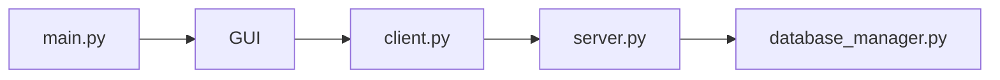
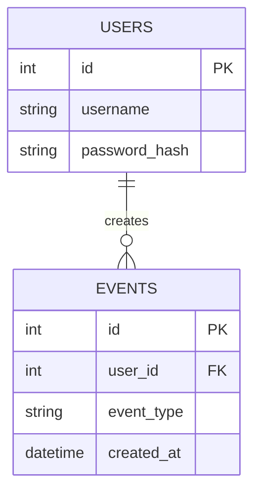

# נספחים

פרק הנספחים מרכז מידע נוסף שיכול לסייע לקורא להבין את הפרויקט, אך אינו מתאים להופיע בגוף המרכזי של תיק הפרויקט.

הנספחים יכולים לכלול חומר טכני משלים, הסברים מפורטים, טבלאות גדולות, תרשימים נוספים, קבצי הגדרות, צילומי מסך, מידע על טכנולוגיות וכן את קוד המקור המלא של הפרויקט.

חשוב: **צירוף כל קוד הפרויקט הוא דרישת חובה**.

אין להסתפק בקישור ל־GitHub, בקובץ ZIP או במספר קטעי קוד נבחרים בלבד. יש לצרף לתיק הפרויקט את הקוד המלא בצורה קריאה ומסודרת.

---

# 1. מטרת הנספחים

מטרת הנספחים היא לשמור את גוף תיק הפרויקט ברור ולא עמוס, ובמקביל לאפשר לבוחן או לקורא להגיע למידע מפורט יותר כאשר הוא זקוק לו.

לדוגמה, במקום להכניס לפרק הארכיטקטורה טבלה של עשרות שדות או קובץ הגדרות שלם, ניתן להציג את החלק העיקרי בגוף העבודה ואת הפירוט המלא בנספחים.

---

# 2. חלוקה מומלצת של הנספחים

מומלץ לחלק את הנספחים לפי נושאים.

לדוגמה:

* נספח א' – קוד המקור המלא.
* נספח ב' – קבצי הגדרות.
* נספח ג' – מבנה בסיס הנתונים.
* נספח ד' – פרוטוקול התקשורת המלא.
* נספח ה' – בדיקות נוספות.
* נספח ו' – הסברים על טכנולוגיות.
* נספח ז' – צילומי מסך נוספים.

אין חובה לכלול את כל הסעיפים האלה. יש לבחור רק נספחים שרלוונטיים לפרויקט.

---

# 3. נספח חובה – קוד המקור המלא

## חובה לצרף את כל הקוד

יש לצרף את **כל קבצי קוד המקור של הפרויקט**.

לדוגמה, בפרויקט Client-Server יש לצרף:

* קוד ה־Client.
* קוד ה־Server.
* מחלקות העזר.
* קוד ממשק המשתמש.
* קוד מסד הנתונים.
* מודולי אבטחה.
* מודולי תקשורת.
* קוד האלגוריתמים.
* קבצי Python נוספים שנכתבו כחלק מהפרויקט.

אם הפרויקט מחולק למספר קבצים, יש לצרף כל אחד מהם בנפרד וברור.

---

# 4. כיצד להציג את הקוד

הקוד צריך להיות מוצג כטקסט מסודר.

אין לצרף צילומי מסך של הקוד.

לא נכון:

> צילום מסך מתוך Visual Studio Code.

נכון:

```python id="1nz869"
class Client:
    def __init__(self, server_ip, port):
        self.server_ip = server_ip
        self.port = port
        self.socket = None

    def connect(self):
        # יצירת החיבור לשרת
        pass
```

כך ניתן לקרוא את הקוד בצורה ברורה, לחפש בו ולהעתיק חלקים ממנו במידת הצורך.

---

# 5. סדר הצגת הקוד

מומלץ להציג את הקוד לפי המבנה הלוגי של הפרויקט.

לדוגמה:

```text id="chc0pf"
נספח א' – קוד המקור

A.1 server.py
A.2 client.py
A.3 database_manager.py
A.4 security_manager.py
A.5 login_window.py
A.6 main_window.py
```

לפני כל קובץ יש להציג:

* שם הקובץ.
* משפט קצר המתאר את תפקידו.

לדוגמה:

## A.1 – server.py

קובץ זה מכיל את הקוד הראשי של השרת ואחראי על קבלת חיבורי Clients, קבלת בקשות והעברתן לטיפול.

```python id="bjg8o0"
# כאן יופיע הקוד המלא של server.py
```

---

# 6. אין להשמיט חלקים מהקוד

כאשר מצרפים את הקוד בנספחים, אין להשתמש בניסוחים כמו:

```text id="f0x4r5"
...
rest of code
...
```

או:

```text id="c5weoj"
# חלק מהקוד הושמט
```

הנספח צריך לכלול את **כל הקוד**.

הדבר שונה מפרק "מימוש הפרויקט", שבו מציגים רק קטעי קוד מרכזיים.

בפרק המימוש המטרה היא להסביר.

בנספחים המטרה היא לתעד את **כל התוצר**.

---

# 7. תיעוד הקוד

הקוד המצורף צריך להיות קריא ומתועד.

יש להוסיף הערות במקומות שבהם הן עוזרות להבנת הקוד.

לדוגמה:

```python id="1rogal"
def receive_message(sock):
    # קבלת ארבעה בתים המייצגים את אורך ההודעה
    header = sock.recv(4)

    # המרת האורך למספר שלם
    message_length = int.from_bytes(header, "big")

    # קבלת תוכן ההודעה
    return sock.recv(message_length)
```

אין צורך להוסיף הערה לכל שורה.

הערות צריכות להסביר בעיקר:

* אלגוריתם לא ברור.
* פעולה מורכבת.
* החלטה מיוחדת.
* חלק בעל משמעות אבטחתית.
* קטע קוד שאינו מובן מיד מקריאת השמות.

---

# 8. שמירה על פורמט הקוד

יש להקפיד שהקוד המודפס יישאר קריא.

מומלץ:

* להשתמש בגופן Monospace עבור קוד.
* לשמור על ההזחות המקוריות.
* לא לשבור שורות בצורה שפוגעת בקריאות.
* להפריד בין קבצים.
* להציג את שם הקובץ מעל כל קטע.
* להשתמש בגודל כתב שמאפשר קריאה נוחה.

לדוגמה, גופנים מתאימים לקוד:

* Consolas.
* Courier New.
* Source Code Pro.

---

# 9. עץ קבצים מלא

בתחילת נספח הקוד מומלץ להציג את מבנה הפרויקט.

לדוגמה:

```text id="v3o7iy"
project/
│
├── client/
│   ├── client.py
│   ├── login_window.py
│   └── main_window.py
│
├── server/
│   ├── server.py
│   ├── database_manager.py
│   └── security_manager.py
│
├── database/
│   └── users.db
│
├── assets/
│   └── icons/
│
├── config.json
└── requirements.txt
```

עץ הקבצים מאפשר לקורא להבין את מבנה הפרויקט לפני שהוא מתחיל לקרוא את הקוד.

---

# 10. תרשים קשר בין קבצי הקוד

אם הפרויקט מחולק למספר מודולים משמעותיים, ניתן להוסיף תרשים אחד קצר שמראה כיצד קבצי הקוד המרכזיים קשורים זה לזה.

לדוגמה:



תרשים זה אינו חובה.

אם כבר קיים תרשים דומה בפרק הארכיטקטורה, אין צורך לחזור עליו.

---

# 11. קבצי הגדרות

אם בפרויקט קיימים קבצי הגדרות משמעותיים, ניתן לצרף אותם כנספח.

לדוגמה:

* `config.json`
* `.env.example`
* קובץ הגדרת Server.
* קובץ Ports.
* קובץ הגדרות משתמש.

לדוגמה:

```json id="b9rxrp"
{
  "server_ip": "192.168.1.10",
  "port": 5050,
  "log_level": "INFO"
}
```

חשוב לא לצרף מידע רגיש אמיתי.

אין לצרף:

* סיסמאות אמיתיות.
* API Keys.
* Tokens.
* Private Keys.
* סודות או Credentials.

אם קיימים ערכים כאלה, יש להחליף אותם בערכי דוגמה.

---

# 12. מבנה בסיס הנתונים

אם בסיס הנתונים מורכב יחסית, ניתן לצרף בנספחים פירוט מלא שלו.

לדוגמה:

| טבלה     | תפקיד         |
| -------- | ------------- |
| Users    | שמירת משתמשים |
| Events   | שמירת אירועים |
| Logs     | תיעוד פעולות  |
| Settings | הגדרות מערכת  |

ניתן להוסיף גם תרשים קשרים אם יש מספר טבלאות עם קשרים ביניהן.

לדוגמה:



יש להשתמש בתרשים כזה רק אם קיימים קשרים בין טבלאות והוא באמת עוזר להבנת בסיס הנתונים.

---

# 13. פרוטוקול תקשורת מלא

אם בפרק הארכיטקטורה הוצג רק סיכום של פרוטוקול התקשורת, ניתן לצרף בנספחים את הפירוט המלא.

לדוגמה:

| הודעה    | שדות                      | כיוון           | תיאור     |
| -------- | ------------------------- | --------------- | --------- |
| LOGIN    | username, password        | Client → Server | התחברות   |
| REGISTER | username, password, email | Client → Server | הרשמה     |
| GET_DATA | request_id                | Client → Server | בקשת מידע |
| RESPONSE | status, data              | Server → Client | תשובה     |

אם קיימות עשרות הודעות, עדיף להציג את הרשימה המלאה בנספח ולא להעמיס את פרק הארכיטקטורה.

---

# 14. בדיקות נוספות

ניתן לצרף בנספחים בדיקות מפורטות שאינן הכרחיות להצגה בגוף הפרויקט.

לדוגמה:

* לוגים מבדיקות.
* תוצאות בדיקות עומס.
* פלט Wireshark.
* טבלאות בדיקות ארוכות.
* תרחישי קצה.
* בדיקות שבוצעו לאחר תיקון תקלות.

אין צורך לשכפל את טבלת הבדיקות שכבר נמצאת בפרק המימוש.

---

# 15. הסברים על טכנולוגיות

אם נעשה שימוש בטכנולוגיה מורכבת שדורשת הסבר ארוך, ניתן להעביר את ההסבר המפורט לנספחים.

לדוגמה:

* הסבר מפורט על TCP.
* מבנה Packet.
* AES.
* Hashing.
* Salt.
* Threads.
* REST.
* JWT.
* Scapy.
* WebSocket.

בגוף הפרויקט מציגים רק את מה שדרוש להבנת המערכת.

בנספח ניתן להרחיב.

---

# 16. צילומי מסך נוספים

ניתן לצרף צילומי מסך שלא היה צורך להכניס לגוף העבודה.

לדוגמה:

* מסכי Debug.
* הודעות שגיאה.
* מסכי הגדרות.
* פלט Wireshark.
* צילום מסד הנתונים.
* תוצאות בדיקות.

יש להוסיף כיתוב קצר מתחת לכל צילום.

לדוגמה:

> איור 1 – תעבורת TCP שנקלטה במהלך בדיקת Client-Server.

---

# 17. הפניה לנספחים מתוך גוף העבודה

כאשר מידע נוסף נמצא בנספח, מומלץ להפנות אליו מתוך הפרק הרלוונטי.

לדוגמה:

> קוד המחלקה המלא מופיע בנספח א', סעיף A.4.

או:

> פירוט מלא של הודעות פרוטוקול התקשורת מופיע בנספח ד'.

כך הקורא יודע היכן למצוא מידע נוסף.

---

# 18. GitHub – תוספת ולא תחליף

מומלץ מאוד לשמור את הפרויקט גם ב־GitHub ולהוסיף קישור למאגר.

לדוגמה:

```text id="7x3g66"
Project Repository:
https://github.com/username/project-name
```

עם זאת:

**קישור ל־GitHub אינו מחליף את הדרישה לצרף את כל קוד המקור לתיק הפרויקט.**

גם אם הפרויקט נמצא במלואו ב־GitHub, הקוד המלא עדיין צריך להופיע בנספחים.

---

# מבנה מומלץ לפרק הנספחים

דוגמה:

```text id="elgnwk"
נספחים

נספח א' – קוד המקור המלא
    A.1 עץ הקבצים
    A.2 server.py
    A.3 client.py
    A.4 database_manager.py
    A.5 security_manager.py
    A.6 קבצי GUI

נספח ב' – קבצי הגדרות

נספח ג' – בסיס הנתונים

נספח ד' – פרוטוקול התקשורת המלא

נספח ה' – בדיקות נוספות

נספח ו' – הסברים טכנולוגיים

נספח ז' – צילומי מסך נוספים
```

אין חובה ליצור נספח נפרד לכל אחד מהנושאים.

יש להתאים את המבנה לפרויקט עצמו.

---

# בדיקה לפני הגשה

לפני הגשת תיק הפרויקט יש לוודא:

* [ ] מצורף עץ הקבצים של הפרויקט.
* [ ] מצורפים כל קבצי קוד המקור.
* [ ] אף חלק מהקוד לא הושמט.
* [ ] הקוד מוצג כטקסט ולא כצילומי מסך.
* [ ] הקוד קריא ושומר על הזחות.
* [ ] כל קובץ מופיע תחת כותרת ברורה.
* [ ] קיימות הערות בקוד במקומות הרלוונטיים.
* [ ] אין סיסמאות, Tokens או מפתחות סודיים אמיתיים.
* [ ] צורפו קבצי הגדרות רלוונטיים, אם קיימים.
* [ ] קיימות הפניות מהפרקים לנספחים כאשר הדבר נדרש.

---

# סיכום

פרק הנספחים משלים את תיק הפרויקט ומאפשר להציג מידע מפורט מבלי להעמיס על הפרקים המרכזיים.

הדרישה החשובה ביותר בפרק זה היא:

## חובה לצרף את כל קוד המקור של הפרויקט.

הקוד צריך להיות מוצג בצורה מסודרת, קריאה ומתועדת, ולא באמצעות צילומי מסך.

תרשימי Mermaid אינם מרכזיים בפרק זה. ברוב הפרויקטים מספיק **0–2 תרשימים**, למשל:

1. תרשים קצר של הקשרים בין קבצי הקוד.
2. תרשים ER של בסיס הנתונים, אם קיים בסיס נתונים מורכב.

אם התרשימים כבר מופיעים בצורה ברורה בפרקים הקודמים, אין צורך לחזור עליהם בנספחים.
