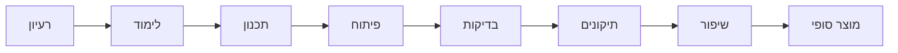

# רפלקציה / סיכום אישי

פרק הרפלקציה נועד לתאר את חוויית העבודה האישית על הפרויקט ולא רק את התוצאה הטכנית.

זהו המקום שבו התלמיד מסביר כיצד התקדם לאורך הדרך, מה למד, אילו קשיים פגש, כיצד פתר אותם, מה הצליח במיוחד ומה היה משנה אילו היה מתחיל את הפרויקט מחדש.

הרפלקציה צריכה להיות אישית, כנה ומפורטת.

אין להסתפק במשפטים כלליים כמו:

> היה לי מעניין ולמדתי הרבה.

יש להסביר **מה בדיוק היה מעניין, מה נלמד, מה היה קשה וכיצד התלמיד התמודד עם הקושי**.

מומלץ שהרפלקציה תהיה באורך של לפחות חצי עמוד ועד עמוד מלא.

---

# 1. תהליך העבודה על הפרויקט

יש לתאר בקצרה את הדרך שעבר הפרויקט מתחילתו ועד סופו.

מומלץ להתייחס לשלבים כמו:

* בחירת הרעיון.
* לימוד התחום.
* אפיון המערכת.
* תכנון הארכיטקטורה.
* כתיבת הקוד.
* שילוב הרכיבים.
* בדיקות.
* תיקון תקלות.
* שיפור המוצר.
* כתיבת תיק הפרויקט.

אין צורך לתאר שוב את כל לוח הזמנים, אלא להסביר את **החוויה והתהליך האישי**.

לדוגמה:

> בתחילת העבודה הגדרתי את המטרות המרכזיות של המערכת ולאחר מכן התחלתי ללמוד את הטכנולוגיות הדרושות. בשלב הראשון התמקדתי ביכולת הבסיסית ביותר של הפרויקט, ורק לאחר שהצלחתי לגרום לה לפעול עברתי להוספת יכולות נוספות. במהלך הפיתוח שיניתי מספר החלטות מהתכנון הראשוני בעקבות בעיות שהתגלו בזמן העבודה.

אפשר להמחיש את תהליך הלמידה והפיתוח בתרשים קצר:

התרשים אינו מחליף את ההסבר האישי, אלא מסכם חזותית את הדרך שעבר הפרויקט.

---

# 2. הצלחות בפרויקט

יש לתאר אילו חלקים בפרויקט הצליחו במיוחד.

מומלץ לבחור 2–3 הצלחות משמעותיות ולהסביר אותן.

לדוגמה:

* הצלחה ביצירת תקשורת בין Client ל־Server.
* הצלחה בשילוב ממשק משתמש עם לוגיקת המערכת.
* הצלחה בזיהוי אירועים חשודים.
* הצלחה בשמירת מידע במסד נתונים.
* הצלחה במימוש מנגנון אבטחה.
* הצלחה בפתרון תקלה מורכבת.

בכל הצלחה כדאי להסביר:

* מה רציתי להשיג.
* מה היה הקושי.
* מה עשיתי.
* מה הייתה התוצאה.

לדוגמה:

> אחת ההצלחות המרכזיות שלי הייתה לגרום לשרת לטפל במספר בקשות שונות לפי סוג ההודעה שהתקבלה. בתחילת העבודה כל בקשה טופלה בצורה נפרדת ולא מסודרת. לאחר ששיניתי את מבנה הפרוטוקול והוספתי שדה action לכל הודעה, הקוד הפך ברור וגמיש יותר.

---

# 3. קשיים ואתגרים

יש לתאר את הקשיים המרכזיים שהתלמיד פגש במהלך העבודה.

אפשר להתייחס ל:

* קושי בהבנת טכנולוגיה חדשה.
* תקלות בתקשורת.
* שגיאות במסד הנתונים.
* בעיות בממשק.
* בעיות Threads.
* בעיות הרשאות.
* בעיות ברשת.
* שגיאות שלא היה ברור מה מקורן.
* קושי בארגון הקוד.
* קושי בניהול הזמן.

אין צורך להציג כל באג קטן.

מומלץ לבחור את האתגרים שהשפיעו באמת על תהליך העבודה.

---

# 4. כיצד פתרתי את הבעיות

לכל קושי משמעותי יש להסביר כיצד התלמיד ניגש לפתרון.

לדוגמה:

* שימוש ב־Debug.
* הוספת הדפסות זמניות לקוד.
* בדיקת התעבורה באמצעות Wireshark.
* חיפוש בתיעוד רשמי.
* בניית תוכנית קטנה לבדיקת רכיב אחד בלבד.
* התייעצות עם המורה.
* ניסוי של מספר פתרונות.
* שינוי הארכיטקטורה.

לדוגמה:

> כאשר ה־Client לא הצליח לקבל הודעות גדולות מהשרת, בהתחלה חשבתי שהבעיה נמצאת במבנה ה־JSON. לאחר בדיקות גיליתי ש־recv אינו מבטיח קבלת כל ההודעה בפעם אחת. בעקבות זאת שיניתי את הפרוטוקול כך שאורך ההודעה נשלח לפני תוכן ההודעה.

דוגמה כזאת טובה במיוחד משום שהיא מראה:

**בעיה → בדיקה → הבנה → פתרון.**

---

# 5. תהליך הלמידה

יש לתאר מה התלמיד למד במהלך העבודה שלא ידע לפני תחילת הפרויקט.

מומלץ להיות ספציפיים.

במקום:

> למדתי Python.

עדיף:

> למדתי כיצד להשתמש ב־Sockets כדי להעביר מידע בין מחשבים וכיצד להתמודד עם מצב שבו הודעת TCP אינה מתקבלת בשלמותה בפעולת recv אחת.

דוגמאות לנושאים שניתן לציין:

* TCP / UDP.
* Sockets.
* Threads.
* הצפנה.
* Hash.
* Authentication.
* עבודה עם Database.
* SQL.
* GUI.
* REST API.
* עבודה עם קבצים.
* Scapy.
* ניתוח Packets.
* Git ו־GitHub.
* טיפול בחריגות.
* תכנון מערכת Client-Server.

יש להתייחס רק לנושאים שבאמת נלמדו במסגרת הפרויקט.

---

# 6. למידה עצמאית

יש להסביר אילו דברים התלמיד נדרש ללמוד בעצמו.

אפשר לציין באילו מקורות נעזר:

* תיעוד רשמי.
* אתרי אינטרנט.
* סרטוני הדרכה.
* ספרים.
* פורומים.
* המורה.
* חברים.
* כלי בינה מלאכותית, אם נעשה בהם שימוש.

אך חשוב יותר להסביר **מה נלמד**, ולא רק איפה חיפשו מידע.

לדוגמה:

> כדי לממש את מנגנון קליטת החבילות למדתי באופן עצמאי כיצד Scapy מייצגת שכבות שונות של Packet וכיצד ניתן לבדוק אם קיימת שכבת TCP, UDP או ICMP.

---

# 7. עזרה ממומחים ולמידת עמיתים

יש לתאר אם במהלך העבודה התקבלה עזרה מאנשים אחרים.

לדוגמה:

* המורה המנחה.
* תלמידים אחרים.
* אנשי מקצוע.
* בני משפחה בעלי ידע בתחום.
* קהילות מקוונות.

יש להסביר מה היה אופי העזרה.

לדוגמה:

> נעזרתי במורה כדי להבין מדוע התוכנית נתקעת כאשר ה־GUI וה־Sniffer פועלים באותו Thread. לאחר ההסבר למדתי כיצד להעביר את פעולת הקליטה ל־Thread נפרד.

המטרה אינה להראות שהתלמיד עשה הכול ללא עזרה, אלא להראות שהוא יודע **לקבל מידע, להבין אותו ולהשתמש בו בצורה נכונה**.

---

# 8. מה הייתי עושה אחרת

יש להסתכל לאחור ולבחון אילו החלטות היה כדאי לשנות.

אפשר להתייחס ל:

* בחירת טכנולוגיה.
* מבנה המחלקות.
* תכנון הפרוטוקול.
* מבנה בסיס הנתונים.
* ממשק המשתמש.
* חלוקת הזמן.
* סדר הפיתוח.
* ביצוע בדיקות מוקדם יותר.

לדוגמה:

> אם הייתי מתחיל את הפרויקט מחדש, הייתי מגדיר את פרוטוקול התקשורת בצורה מלאה לפני תחילת פיתוח ה־GUI. בפועל שיניתי מספר פעמים את מבנה ההודעות, ולכן נדרשתי לבצע שינויים גם בצד הלקוח וגם בצד השרת.

---

# 9. כיצד הייתי משפר את הפרויקט

יש להסביר אילו שיפורים ניתן היה לבצע אילו היו יותר זמן, ידע או משאבים.

לדוגמה:

* שיפור ממשק המשתמש.
* הוספת הצפנה.
* שיפור ביצועים.
* תמיכה במספר משתמשים.
* הוספת מערכת הרשאות.
* הוספת לוגים.
* שמירת מידע בענן.
* הוספת התראות.
* הרחבת מנגנון הזיהוי.
* בדיקות עומס.

חשוב לבחור שיפורים הגיוניים ורלוונטיים לפרויקט.

לא מספיק לכתוב:

> הייתי מוסיף עוד אפשרויות.

יש להסביר אילו אפשרויות ולמה הן חשובות.

---

# 10. כלים וידע שאני לוקח להמשך

יש לתאר אילו דברים מהפרויקט יהיו שימושיים בהמשך הלימודים או בפרויקטים עתידיים.

לדוגמה:

* עבודה מסודרת עם Git.
* פירוק בעיה גדולה לשלבים.
* תכנון לפני כתיבת קוד.
* Debug שיטתי.
* כתיבה באמצעות מחלקות.
* בדיקות תוכנה.
* שימוש בתיעוד.
* הבנה של תקשורת בין מחשבים.
* חשיבה על אבטחת המערכת כבר בשלב התכנון.

---

# 11. תובנות אישיות

זהו המקום לכתוב מה התלמיד הבין על עצמו כמתכנת וכמי שמפתח מערכת גדולה יחסית.

אפשר להתייחס לשאלות כמו:

* באיזה חלק בפרויקט הרגשתי הכי בטוח?
* מה היה החלק שהכי התקשה בו?
* האם אני מעדיף עבודה על Backend, GUI, Database או Networking?
* כיצד השתנתה הדרך שבה אני ניגש לבעיה?
* האם למדתי לעבוד בצורה מסודרת יותר?
* האם למדתי לבדוק לפני שאני משנה קוד?
* מה הפתיע אותי במהלך העבודה?

---

# 12. תודות

ניתן לסיים בתודות קצרות לאנשים שעזרו במהלך העבודה.

לדוגמה:

> אני רוצה להודות למורה המנחה על הליווי והעזרה לאורך תהליך הפיתוח, ולחברי הכיתה שעזרו בבדיקת המערכת ובהעלאת רעיונות לשיפור.

אין חובה לכתוב תודות ארוכות.

---

# מבנה מומלץ לרפלקציה הסופית

הרפלקציה אינה צריכה להיראות כמו שאלון שבו עונים במשפט על כל סעיף.

מומלץ להפוך את הנושאים לפסקאות רציפות.

מבנה אפשרי:

### פסקה 1 – תחילת הדרך

איך התחיל הפרויקט ומה היו הציפיות.

### פסקה 2 – תהליך הפיתוח

מה היו השלבים המרכזיים ומה השתנה לאורך הדרך.

### פסקה 3 – אתגרים

מה היה קשה וכיצד הבעיות נפתרו.

### פסקה 4 – למידה

איזה ידע וטכנולוגיות חדשות נלמדו.

### פסקה 5 – מבט לאחור

מה הייתי עושה אחרת ומה הייתי משפר.

### פסקה 6 – סיכום אישי

מה אני לוקח מהתהליך להמשך.

---

# דוגמה קצרה לסגנון כתיבה

בתחילת הפרויקט חשבתי שהחלק המרכזי והקשה ביותר יהיה בניית ממשק המשתמש, אך במהלך העבודה גיליתי שדווקא התקשורת בין רכיבי המערכת דורשת ממני יותר למידה והתמודדות עם בעיות. אחת הבעיות המשמעותיות הייתה טיפול נכון בהודעות שעוברות בין ה־Client ל־Server. לאחר מספר ניסיונות הבנתי שאני צריך לתכנן את מבנה ההודעות בצורה מסודרת יותר.

במהלך הפרויקט למדתי לא רק טכנולוגיות חדשות, אלא גם כיצד לגשת לבעיה בצורה מסודרת. במקום לנסות לפתור מערכת שלמה בבת אחת, למדתי לבודד כל חלק, לבדוק אותו בנפרד ורק לאחר מכן לשלב אותו עם שאר המערכת.

אם הייתי מתחיל את הפרויקט מחדש, הייתי משקיע יותר זמן בתכנון הארכיטקטורה ופרוטוקול התקשורת לפני תחילת כתיבת הקוד. שינויי תכנון שביצעתי באמצע העבודה דרשו ממני לשנות מספר חלקים שכבר פעלו.

למרות הקשיים, העבודה על הפרויקט נתנה לי ניסיון בפיתוח מערכת גדולה יותר מהתרגילים הרגילים שביצעתי במהלך הלימודים, והראתה לי את החשיבות של תכנון, בדיקות, עבודה מסודרת והתמודדות עצמאית עם בעיות.

---

# סיכום

בסיום הרפלקציה הקורא צריך להבין לא רק **מה התלמיד בנה**, אלא גם **איזה תהליך התלמיד עבר במהלך בניית הפרויקט**.

הרפלקציה צריכה לשקף:

* את תהליך העבודה.
* הצלחות.
* קשיים.
* דרכי פתרון.
* למידה עצמאית.
* ידע חדש שנרכש.
* עזרה ושיתוף עם אחרים.
* החלטות שהיה כדאי לשנות.
* שיפורים אפשריים.
* תובנות וכלים להמשך.

בפרק זה אין צורך בריבוי תרשימים. אם רוצים לשלב אלמנט חזותי, בדרך כלל **תרשים אחד של תהליך העבודה** מספיק בהחלט. עיקר הפרק צריך להיות כתיבה אישית ומשמעותית של התלמיד.
